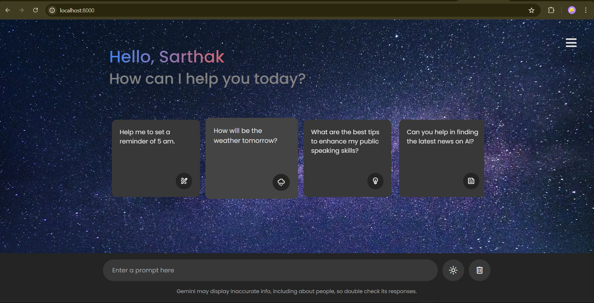
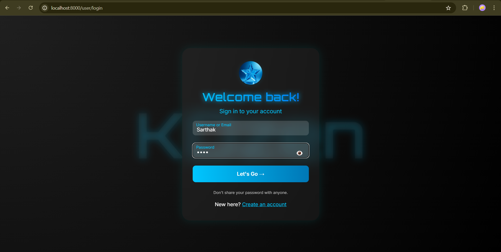

# KOzen AI Chatbot 🤖

A modern, responsive AI chatbot web application built with Node.js, Express, and MongoDB. Features a beautiful dark/light theme interface with real-time chat capabilities powered by Google's Gemini AI.


## ✨ Features

- 🤖 **AI-Powered Chat**: Real-time conversations with Google's Gemini AI
- 🌓 **Dark/Light Theme**: Toggle between themes with smooth transitions
- 👤 **User Authentication**: Secure login/signup system with session management
- 💬 **Smart Suggestions**: Pre-defined conversation starters for quick interactions
- 📱 **Responsive Design**: Works seamlessly on desktop and mobile devices
- 🎨 **Modern UI**: Glassmorphism design with beautiful animations
- 📋 **Copy Messages**: One-click copy functionality for chat responses
- 🗑️ **Chat History**: Clear all conversations with a single click
- 🔐 **Password Toggle**: Show/hide password functionality for better UX

## 🚀 Live Demo

[Try KOzen AI Chatbot](https://your-demo-link.com) *(Add your deployed link here)*

## 📸 Screenshots

### Home Screen


### Login Page


### Chat Interface


## 🛠️ Installation

### Prerequisites

- Node.js (v14 or higher)
- MongoDB (v4.4 or higher)
- Google Gemini AI API Key

### Setup Instructions

1. **Clone the repository**
   ```bash
   git clone https://github.com/yourusername/kozen-ai-chatbot.git
   cd kozen-ai-chatbot
   ```

2. **Install dependencies**
   ```bash
   npm install
   ```

3. **Set up MongoDB**
   - Make sure MongoDB is running on your local machine
   - The app will automatically create the database `chatbot`

4. **Configure API Key**
   - Get your Google Gemini AI API key from [Google AI Studio](https://makersuite.google.com/app/apikey)
   - Update the API key in `views/home.ejs`:
   ```javascript
   const API_KEY = `YOUR_GEMINI_API_KEY`;
   ```

5. **Start the application**
   ```bash
   npm start
   ```

6. **Access the application**
   - Open your browser and go to `http://localhost:8000`
   - For login: `http://localhost:8000/user/login`
   - For signup: `http://localhost:8000/user/signup`

## 📁 Project Structure

```
kozen-ai-chatbot/
├── Images/                 # Static images (logo, background, user avatar)
├── views/                  # EJS template files
│   ├── home.ejs           # Main chat interface
│   ├── login.ejs          # Login page
│   └── signup.ejs         # Signup page
├── index.js               # Main server file
├── route.js               # User authentication routes
├── userController.js      # User controller logic
├── models.js              # MongoDB user model
├── connect.js             # Database connection
├── package.json           # Dependencies and scripts
└── README.md             # This file
```

## 🔧 Configuration

### Environment Variables

Create a `.env` file in the root directory:

```env
PORT=8000
MONGODB_URI=mongodb://127.0.0.1:27017/chatbot
SESSION_SECRET=your-secret-key
GEMINI_API_KEY=your-gemini-api-key
```

### API Configuration

The chatbot uses Google's Gemini AI API. Make sure to:

1. Get your API key from [Google AI Studio](https://makersuite.google.com/app/apikey)
2. Update the API key in `views/home.ejs`
3. The API endpoint is configured for `gemini-2.5-flash` model

## 🎯 Usage

1. **Registration/Login**: Create an account or sign in to access the chatbot
2. **Start Chatting**: Type your message or click on suggestion cards
3. **Theme Toggle**: Switch between dark and light themes using the theme button
4. **Copy Responses**: Click the copy icon to copy AI responses
5. **Clear Chat**: Use the delete button to clear all conversations
6. **Dashboard**: Click the hamburger menu to access user dashboard

## 🛡️ Security Features

- Session-based authentication
- Password hashing (implemented in userController.js)
- CORS enabled for cross-origin requests
- Input validation and sanitization
- Secure cookie handling

## 🎨 Customization

### Themes
The application supports both dark and light themes. Theme preferences are saved in localStorage.

### Styling
- Main styles are in `views/home.ejs` (embedded CSS)
- Login/signup styles are in their respective `.ejs` files
- All animations and transitions are CSS-based

### Adding New Features
- Add new routes in `route.js`
- Create new controllers in `userController.js`
- Add new views in the `views/` directory

## 🤝 Contributing

1. Fork the repository
2. Create a feature branch (`git checkout -b feature/AmazingFeature`)
3. Commit your changes (`git commit -m 'Add some AmazingFeature'`)
4. Push to the branch (`git push origin feature/AmazingFeature`)
5. Open a Pull Request

## 📝 License

This project is licensed under the MIT License - see the [LICENSE](LICENSE) file for details.

## 🙏 Acknowledgments

- [Google Gemini AI](https://ai.google.dev/) for the AI capabilities
- [Express.js](https://expressjs.com/) for the web framework
- [MongoDB](https://www.mongodb.com/) for the database
- [EJS](https://ejs.co/) for templating

## 📞 Support

If you have any questions or need help, please:

- Open an issue on GitHub
- Contact: your-email@example.com
- Project Link: [https://github.com/yourusername/kozen-ai-chatbot](https://github.com/yourusername/kozen-ai-chatbot)

---

⭐ **Star this repository if you found it helpful!** 